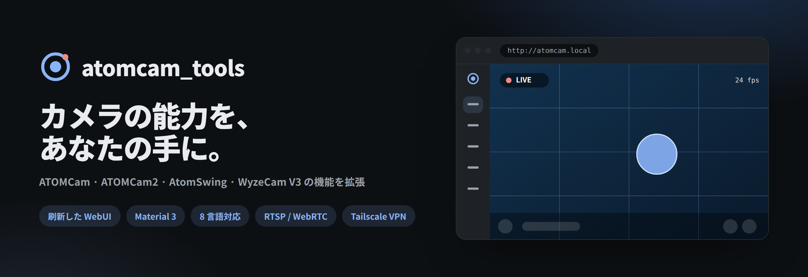
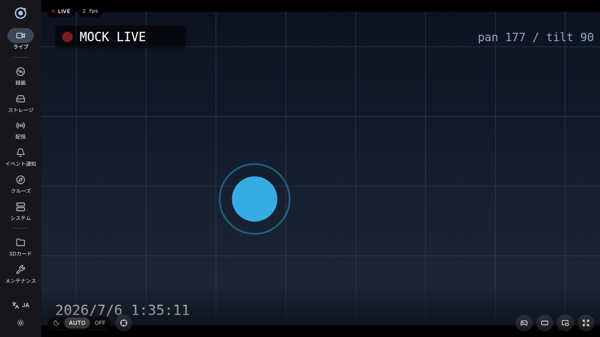
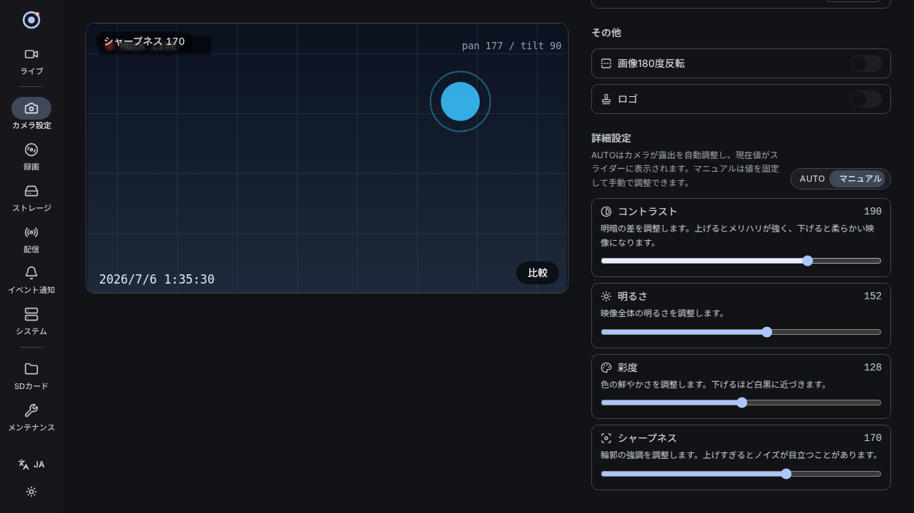
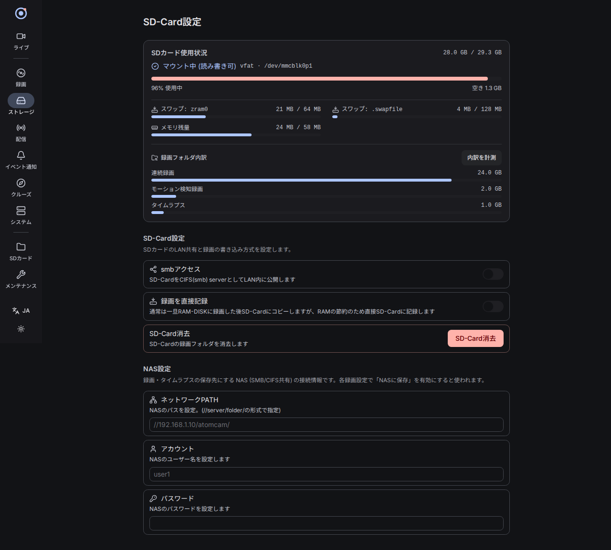

<picture>
  <source media="(prefers-color-scheme: dark)" srcset="docs/assets/banner-dark.png">
  <source media="(prefers-color-scheme: light)" srcset="docs/assets/banner-light.png">
  
</picture>

### ATOMCam / ATOMCam2 / AtomSwing / WyzeCam V3 の機能を拡張するツールキット

[🌐 プロジェクトサイト](https://flll.github.io/atomcam_tools/) ・ [🎬 WebUI ライブデモ](https://flll.github.io/atomcam_tools/demo/) ・ [📦 最新リリース](https://github.com/flll/atomcam_tools/releases/latest)

標準機能に満足できないユーザーが、各自の責任においてカメラの能力を拡張するためのスクリプトとカスタムルートファイルシステムを提供します。

> プロジェクトサイト / ライブデモは GitHub Pages で公開されます（有効化後にリンクが有効になります）。

## フォークについて

本リポジトリは [mnakada/atomcam_tools](https://github.com/mnakada/atomcam_tools) のフォークであり、[flll/atomcam_tools](https://github.com/flll/atomcam_tools) で独自に開発を継続しています。upstream への PR は当面予定していません。

flll フォークでの主な追加・変更:

- **Tailscale VPN** — WebUI から設定可能なリモートアクセス
- **Buildroot 2026.02** — ビルド環境のモダン化（`buildroot-2026.02.1`）
- **Ubuntu 26.04 + Docker** — 推奨ホスト環境
- **AtomSwing シミュレーション** — `make sim-swing` による QEMU 検証

## 免責事項・セキュリティ

- 利用にあたってカメラメーカーへの問い合わせは慎んでください
- 自由に利用できますが、悪用して他人へ迷惑をかけた場合の責任は設定を行った者が負います
- バグ報告・機能要望は [flll Issues](https://github.com/flll/atomcam_tools/issues) へ

本ツールキットは以下のネットワークサービスを有効にします。LAN 内のセキュリティを各自で確保してください。

| サービス | ポート |
|----------|--------|
| WebUI | 80 |
| SSH | 22 |
| mDNS (avahi) | 5353 |
| CIFS/Samba | 137, 138, 139, 445 |
| RTSP | 8554, 8080 |
| WebRTC | 8555 |

> **注意**: WebUI・映像・JPEG は LAN 内からアクセス可能です。SSH は SD カードに公開鍵を書き込む必要があります。ATOMCam は WiFi 認証情報をフラッシュに平文保存しているため、盗難時のリスクに注意してください。

## 対応カメラ・ファームウェア

| カメラ | 対応バージョン |
|--------|----------------|
| ATOMCam | Ver.4.33.3.68, 4.33.3.73 |
| ATOMCam2 | Ver.4.58.0.139, 4.58.0.154, 4.58.0.160 |
| AtomSwing | Ver.4.37.1.152, 4.37.1.162, 4.37.1.166 |
| WyzeCam V3 | Ver.4.36.9.139（実験的） |

WyzeCam V3 の制限: 4.36.10.xx 以降では動作しません。未検証機能があり、H.265 には非対応です。

AtomSwing の画面プレビュー

<kbd></kbd>

WyzeCam V3 の画面プレビュー

<kbd></kbd>

## 主な機能

| カテゴリ | 内容 |
|----------|------|
| WebUI | 追加設定、Digest 認証、モバイルアプリ代替の一部設定 |
| 録画・配信 | 連続録画、動体検知録画、タイムラプス、RTSP/RTMP/WebRTC、HomeKit |
| ファイル共有 | Samba 共有、Web 経由の SD カード映像閲覧 |
| NAS | CIFS (SMB2+) への自動保存 |
| SSH | 公開鍵認証（パスワードログイン無効） |
| Tailscale | VPN 経由のリモートアクセス（flll フォーク追加） |
| イベント | WebHook 通知、動体検知周期短縮（5 分→30 秒） |
| AtomSwing | Pan/Tilt 操作、クルーズシーケンス |
| カスタマイズ | ビットレート/フレームレート、Watermark、起動スクリプト (`post_icamera.sh`) |

詳細な WebUI 操作手順は [WebUI 詳細ガイド](docs/webui-guide.md) を参照してください。

## スクリーンショット

刷新した WebUI（Material 3・ダークモード・8 言語）。実機がなくても [ライブデモ](https://flll.github.io/atomcam_tools/demo/) で体験できます。

<table>
  <tr>
    <td width="50%"> <b>ライブ</b> — 没入型プレイヤー・シアターモード・PiP・PTZ 操作</td>
    <td width="50%"> <b>カメラ設定</b> — 固定プレビュー・AUTO/マニュアル露出・変更前後の比較</td>
  </tr>
  <tr>
    <td width="50%"> <b>ストレージ</b> — マウント状態・swap・メモリ・録画フォルダ内訳</td>
    <td width="50%" valign="middle">SD カードの使用状況を一目で。連続 / 検知 / タイムラプスのフォルダ内訳、swap（zram / SD）とメモリ残量、マウント状態（rw / ro）まで表示します。</td>
  </tr>
</table>

## インストール

### ダウンロード

1. [flll Releases](https://github.com/flll/atomcam_tools/releases/latest) から `atomcam_tools.zip` をダウンロード
2. 解凍する

### SD カードへの配置

1. 解凍された**すべてのファイル**を microSD カードのルートにコピー
2. 複数台運用時は `hostname` ファイルを編集して重複を避ける
3. microSD カードをカメラに挿入して電源 ON

### SD カード推奨仕様

- Class 10 以上の高速カードを推奨
- **FAT-FS** でフォーマット（exFAT は u-boot 非対応）
- 低速メディアは swap 利用により動作不安定の原因になります

> **注意**: 256 MB 以上のメディアでは AtomCam FW のバグにより record フォルダのファイルが早期削除される問題があります（[Issue #91](https://github.com/mnakada/atomcam_tools/issues/91)）。

## WebUI の使い方

### アクセス方法

1. **mDNS 対応環境**: `http://atomcam.local` を開く
2. **mDNS 非対応環境**: 純正アプリや IP 確認ツールで IP を調べ、`http://[IPアドレス]` を開く

<kbd></kbd>

画面構成: タイトルバー（バージョン・カメラ種別・時刻・言語）、左サイドバー（各設定タブ）。

各ページの詳細は **[WebUI 詳細ガイド](docs/webui-guide.md)** を参照してください。

## ビルド・開発

ソースから SD カード用イメージをビルドする場合は [build.md](build.md) を参照してください。Ubuntu 26.04 + Docker 環境での `make docker-build` → `make build` が推奨です。内部構成の詳細は [docs/development/architecture.md](docs/development/architecture.md) にあります。

## サポート・謝辞

- **バグ報告・機能要望**: [flll GitHub Issues](https://github.com/flll/atomcam_tools/issues)
- **フォーク元**: [mnakada/atomcam_tools](https://github.com/mnakada/atomcam_tools) — オリジナル作者に感謝
- **解説記事** (upstream 著):
  - [ATOMCam2を少し改造して導入してみた](https://qiita.com/mnakada/items/7d0fbcb6e629e1ddbd0c)
  - [AtomSwingを少し改造して遊んでみた](https://qiita.com/mnakada/items/5da19a302b0f7521f225)
  - [atomcam_toolsのtimelapseの負荷低減](https://qiita.com/mnakada/items/eddbf8b6f0095e279095)
  - [atomcam_toolsのHomeKit, RTMP対応](https://qiita.com/mnakada/items/00747fdf048f18a787ff)
  - [ATOMSwingのtimelapseで星座追尾](https://qiita.com/mnakada/items/e2337f7b73e3a9e1539c)
  - [atomcam_toolsのMobileApp代替機能の実装](https://qiita.com/mnakada/items/310954397db6f16fe0b5)

## 著作権・ライセンス

詳細は [LICENSE](LICENSE) ファイルを参照してください。
