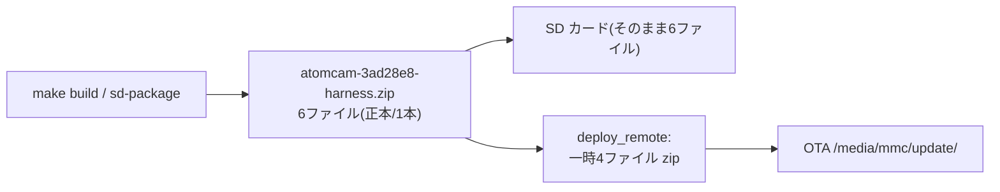

# Build profiles & 1本化された zip

atomcam_tools のビルドは **プロファイル**で Tailscale・HIL・ハーネス資産・エージェント鍵を切り替える。
成果物の **zip は1本**(スーパーセット)。

## クイックスタート

```bash
make configure                  # 対話式(エージェント不要)
make build                      # 既定 = tailscale
make build PROFILE=harness      # 明示
make build-harness              # ショートカット
make help / make profile-list   # 一覧
make release-info               # 次の zip 名プレビュー
```

## プロファイル一覧

| PROFILE | Tailscale | HIL資産 | mmcテンプレ | デバッグ鍵 | sd-package自動 |
|---------|-----------|---------|-------------|------------|----------------|
| `simple` | 無効 | - | - | - | - |
| `tailscale` | 有効(既定) | - | - | - | - |
| `hil` / `cyclo` | 有効 | 有効 | - | - | - |
| `harness` | 有効 | 有効 | 有効 | - | 有効 |
| `agent` | 有効 | 有効 | 有効 | 有効 | 有効 |
| `full` | 有効 | 有効 | 有効 | 有効 | 有効 |

- `cyclo` = HIL サイクル(反復 deploy-test)。`hil` と同内容。
- overlay の起動修正は全プロファイル共通(libcallback は**残す**=hack 有効)。

## zip は1本(重要)

実物比較で判明:

- 旧 deploy zip = 4ファイル(`factory_t31_ZMC6tiIDQN` / `rootfs_hack.squashfs` / `hostname` / `authorized_keys`)
- 旧 SD zip = 6ファイル = 上記 + `tools_configs`(WiFi) + `hack.ini`(起動設定/Tailscale 鍵)

SD zip は deploy zip の**スーパーセット**。よって**1本に統一**:



- **正本**: `target/releases/atomcam-{commit}[-{profile}].zip`
- **別名 symlink**: `atomcam_tools.zip`(deploy) / `target/sd_initial.zip`(SD)。両方とも同じ正本を指す
- **OTA deploy**: `scripts/deploy_remote.sh` が `hack.ini`/`tools_configs` を除いた4ファイル zip を一時生成して送る(カメラの更新名検証を回避)

## zip 名ルール

- 通常: `atomcam-{commit_short}-{profile}.zip` 例 `atomcam-3ad28e8-harness.zip`
- **simple のみ**: profile を付けない → `atomcam-3ad28e8.zip`
- タグ/件名/時刻/atomhack.ver は zip 名に入れず `target/BUILD_MANIFEST.json` に保持

```bash
make release-info    # 次ビルドの名前 + メタ
make artifacts       # symlink と releases/ 一覧
```

## デプロイ

```bash
ATOMCAM_HOST=10.0.0.228 make deploy           # OTA(自動で4ファイルに絞る)
./scripts/deploy_remote.sh 10.0.0.228 --status
./scripts/deploy_remote.sh 10.0.0.228 --rollback
```

## 関連

- [hil-bootstrap.md](hil-bootstrap.md)
- [debug-hil-loop.md](debug-hil-loop.md)
- [refactor-notes.md](refactor-notes.md)
