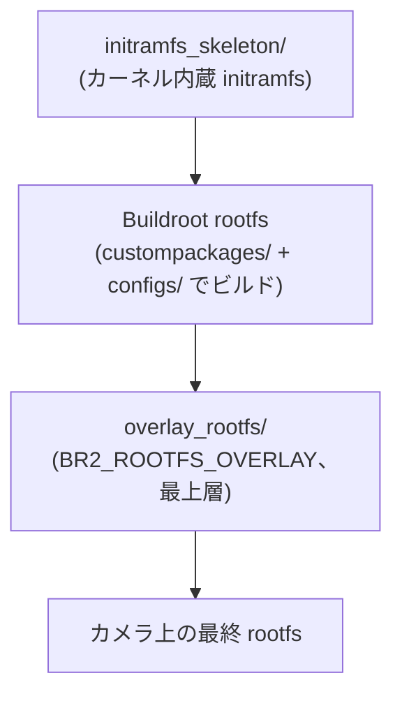

# リポジトリマップ

トップレベルの全ディレクトリ・主要ファイルの一覧。「実行環境」は、その中のコード/スクリプトがどこで実行されるかを示す。

## トップレベル一覧

| パス | 役割 | 実行環境 |
|---|---|---|
| `Makefile` | 開発のエントリポイント (`make docker-build` / `make build` / `make login` / `make sim-swing` など) | ホスト |
| `Dockerfile` | ビルドイメージ定義 (Ubuntu 26.04 + Buildroot 2026.02.1) | ホスト (docker build) |
| `docker-compose.yml` | builder コンテナの定義 | ホスト |
| `lima-docker.yml` | macOS で Docker を動かすための Lima VM 定義 | ホスト (macOS) |
| `build.md` | ビルド手順の詳細ドキュメント | なし |
| `README.md` | プロジェクト概要 | なし |
| `AGENTS.md` | AI エージェント向けオンボーディング | なし |
| `CONTRIBUTING.md` | コントリビュートガイド | なし |
| `buildscripts/` | Buildroot のビルドフック群 | Docker 内 |
| `scripts/` | 開発・検証用スクリプト (`verify_tailscale_*`, `sim_atomswing.sh`) | ホスト |
| `overlay_rootfs/` | `BR2_ROOTFS_OVERLAY`。rootfs の最上層としてカメラに載る | カメラ上 |
| `initramfs_skeleton/` | カーネル内蔵 initramfs のスケルトン | カメラ上 (ブート時) |
| `custompackages/` | br2-external ツリー (`external.desc` name=ATOMCAM_TOOLS、`Config.in`、`package/`) | Docker 内 (ビルド時) |
| `configs/` | Buildroot defconfig / kernel.config / toolchain fragment | Docker 内 (ビルド時) |
| `patches/` | `setup_buildroot.sh` が Buildroot / kernel ツリーへ**手適用**するパッチ | Docker 内 (ビルド時) |
| `global_patches/` | `BR2_GLOBAL_PATCH_DIR` 経由で upstream パッケージへ**自動適用**されるパッチ | Docker 内 (ビルド時) |
| `libcallback/` | uClibc 製 LD_PRELOAD フックライブラリ (glibc rootfs とは別 toolchain) | カメラ上 (ビルドは Docker 内) |
| `web/` | WebUI ソース (Vue + webpack) | カメラ上 (ビルドは Docker 内) |
| `target/` | SD カード成果物のステージディレクトリ (**生成物はコミット禁止**) | なし (成果物置き場) |
| `docker/atomswing-sim/` | AtomSwing QEMU シミュレータ環境 | ホスト (Docker/QEMU) |
| `network_samples/` | ネットワーク設定のサンプル | なし |
| `timelapse_samples/` | タイムラプス設定のサンプル | なし |
| `images/` | ドキュメント用画像 | なし |
| `docs/` | ドキュメント (webui-guide, development/) | なし |

## buildscripts/ の内訳 (すべて Docker 内で実行)

| ファイル | 役割 |
|---|---|
| `build_all` | `make build` から呼ばれるビルド全体のエントリ |
| `setup_buildroot.sh` | Buildroot ツリーの展開・`patches/` の手適用・初期セットアップ |
| `local_build.sh` | WebUI 等のローカル成果物を rootfs へ配置 |
| `post_fakeroot.sh` | rootfs 作成後 (fakeroot 内) のフック |
| `make_initramfs.sh` | カーネル内蔵 initramfs の生成 |
| `linux_prebuild_hook.sh` | カーネルビルド前のフック |
| `post_image.sh` | イメージ生成後のフック |

## overlay_rootfs/ の内訳 (カメラ実機上)

| パス | 役割 |
|---|---|
| `scripts/` | カメラ上で実行される運用スクリプト |
| `etc/init.d/` | 起動スクリプト |
| `var/www/cgi-bin/` | WebUI の CGI |
| `atom_patch/` | ATOM 純正ファームウェアへのパッチ類 |

## patches/ と global_patches/ の違い

- `patches/`: `buildscripts/setup_buildroot.sh` がビルドセットアップ時に Buildroot 本体や kernel ツリーへ **明示的に適用** する。Buildroot のパッチ機構の対象外のもの向け。
- `global_patches/`: Buildroot の `BR2_GLOBAL_PATCH_DIR` に登録され、各 upstream パッケージのビルド時に **自動適用** される。パッケージ単位のパッチ向け。

## rootfs の 3 層構造

カメラに載る最終的なファイルシステムは 3 層の重ね合わせで構成される。

1. **initramfs** (`initramfs_skeleton/`): カーネルに組み込まれ、ブート最初期を担当
2. **Buildroot rootfs**: Buildroot がビルドする基本システム (glibc toolchain)
3. **overlay** (`overlay_rootfs/`): 最上層として被せるカスタムファイル群

なお `libcallback/` は uClibc 製の LD_PRELOAD フックであり、上記 glibc rootfs とは**別の toolchain** でビルドされる点に注意。
